# 📖 Muslim Soul – Ultimate Quran & Islamic App (Flutter)

**Muslim Soul** is a comprehensive Flutter application designed to be the perfect companion for every Muslim. It integrates the Holy Quran, accurate prayer times, Hijri calendar, and an advanced AI-powered Islamic Assistant to help you in your daily spiritual journey.

The app offers a beautiful user interface with smooth animations, advanced features, and a powerful Gemini AI chatbot to answer your Islamic queries instantly.

---


## Why Muslim Soul?
In today's fast-paced world, having quick access to authentic Islamic resources is essential. Muslim Soul aims to bring the Holy Quran, Prayer Times, and Islamic Knowledge to your fingertips, wrapped in an elegant and easy-to-use interface.

---
## 🚀 Key Features
- **Al-Quran Kareem** – Complete Quran with Surah & Juz indexing.
- **AI Islamic Assistant** – Powered by **Google Gemini** for instant answers to Islamic questions.
- **Smart Prayer Times** – Accurate timings based on your location (Fajr, Dhuhr, Asr, Maghrib, Isha).
- **Aya of the Day** – Daily inspiration from the Holy Quran.
- **Hijri Calendar** – Keep track of Islamic dates.
- **Modern UI/UX** – Glassmorphism design, smooth animations, and beautiful typography (Poppins & Amiri).
- **Tasbeeh Counter** – Digital Tasbeeh for your daily Dhikr.

---
### 📖 Quran Reading Experience
- **Surah & Juz Index** → Easy navigation to any part of the Quran.
- **Translation** → Understand the meaning of the verses.
- **Audio Integration** → Listen to beautiful recitations.

### 🤖 AI-Powered Chatbot
- Ask questions about Islam, Quran, and Hadith.
- Get instant, AI-generated responses using **Google Gemini**.
- Clean and interactive chat interface.

### 🕌 Prayer & Fasting
- **Accurate Timings** → Never miss a prayer with precise calculations.
- **Hijri Date** → Stay updated with the Islamic calendar.

### 🎨 Modern Design
- **Elegant Aesthetics** → Emerald Green & Gold color scheme.
- **Animations** → Fluid screen transitions and list animations.
- **Fonts** → Google Fonts integration for premium typography.

---
## App Screenshots
<p align="center">
  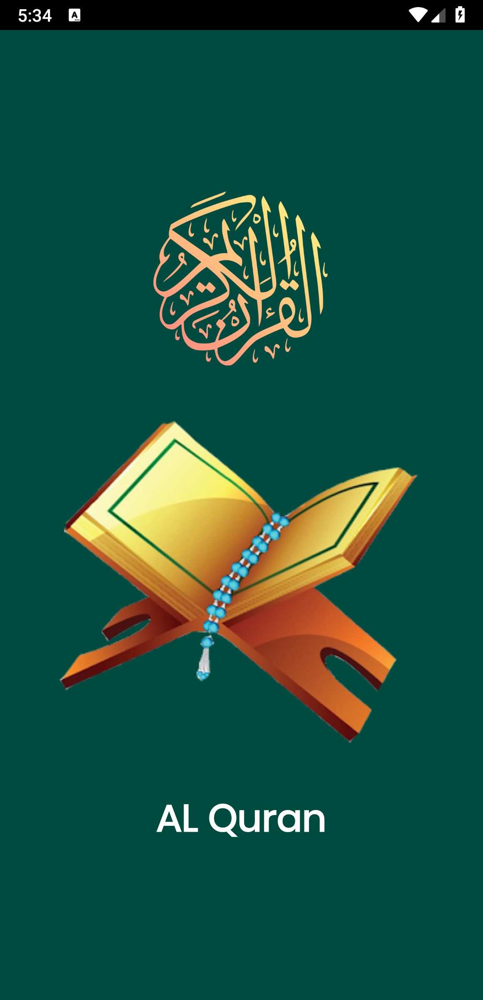
  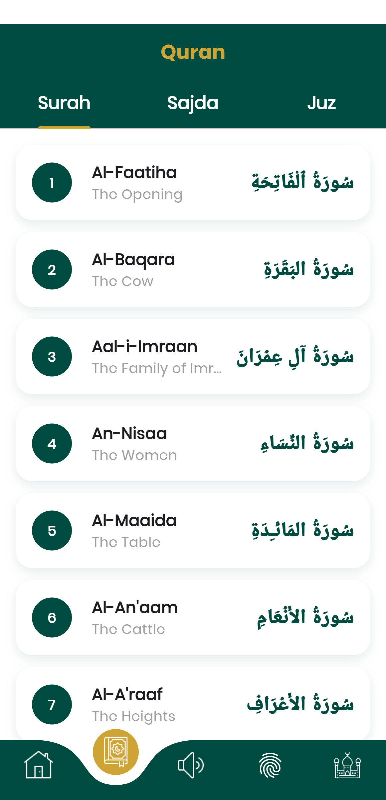
  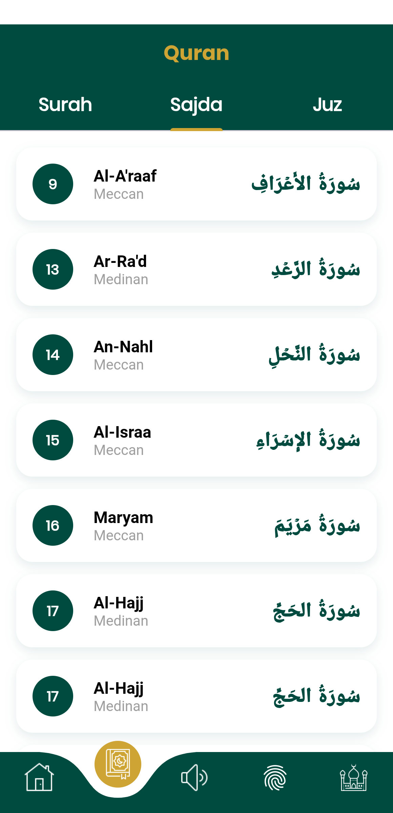
  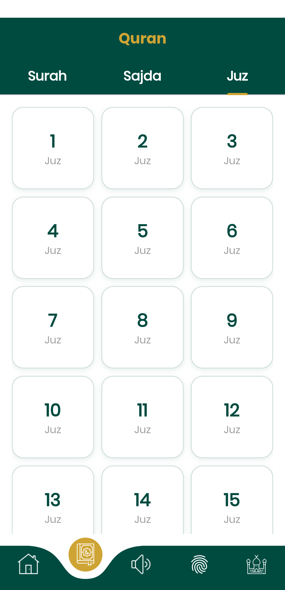
  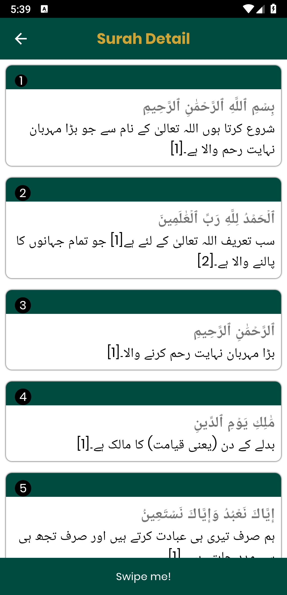
  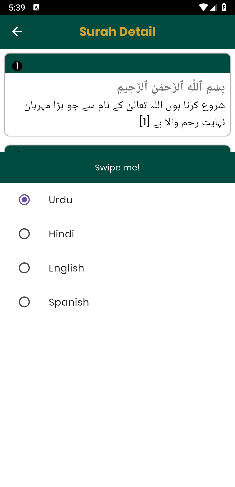
  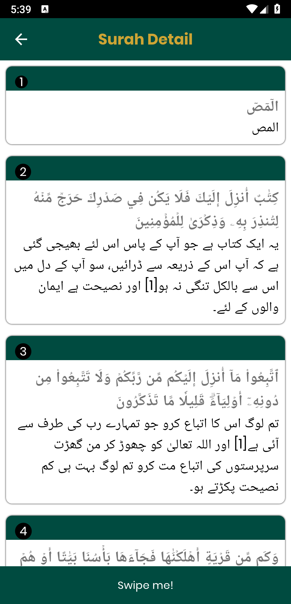
  
  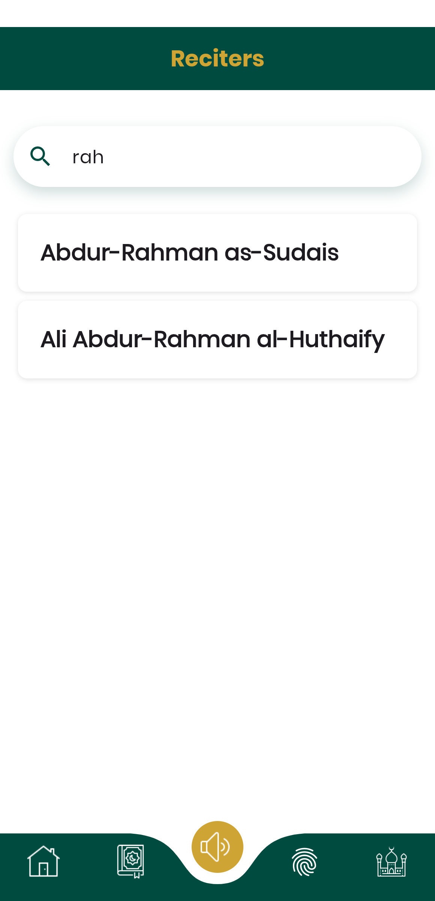
  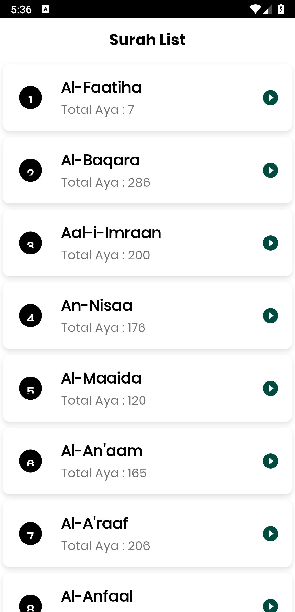
  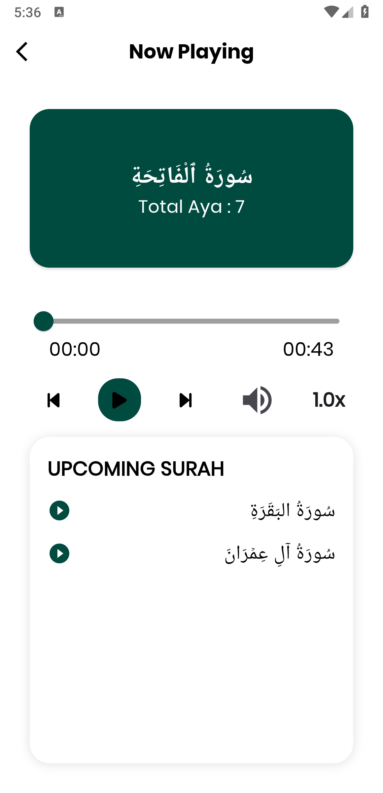
  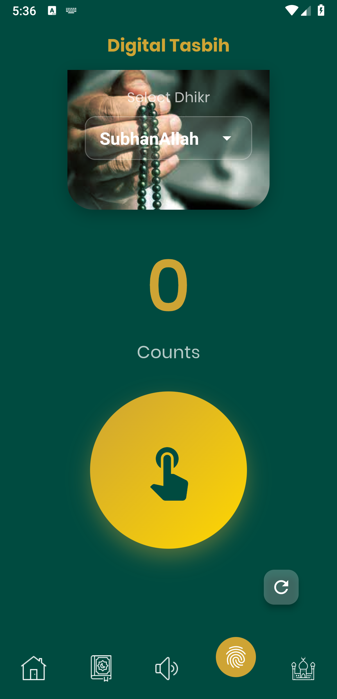
  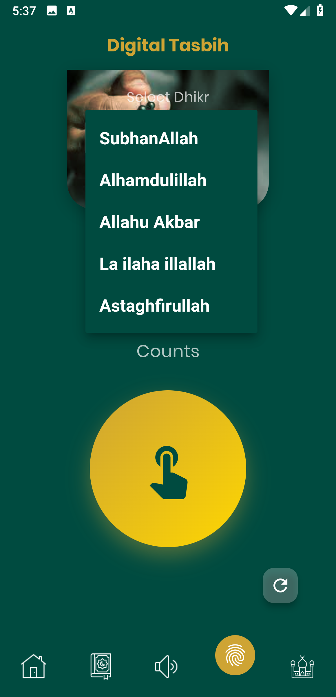
  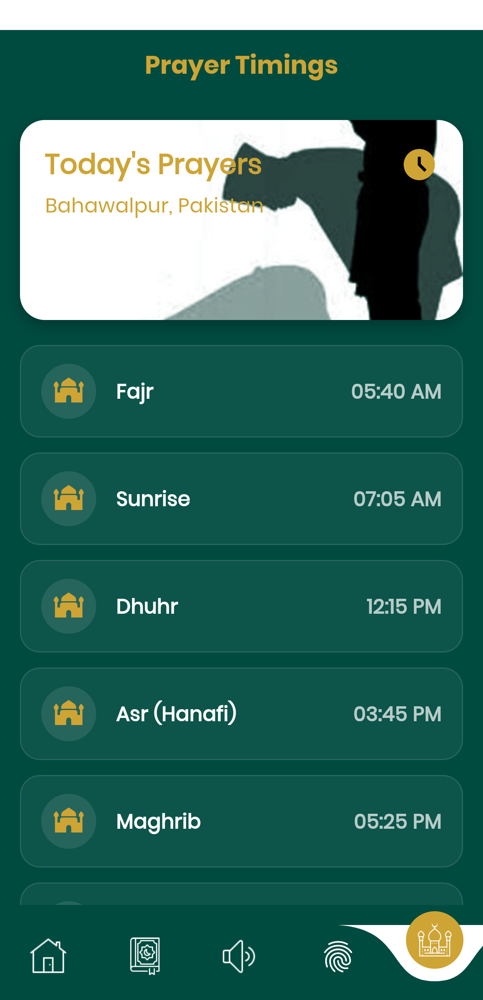
  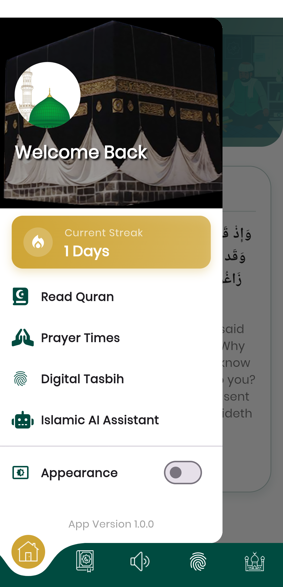
  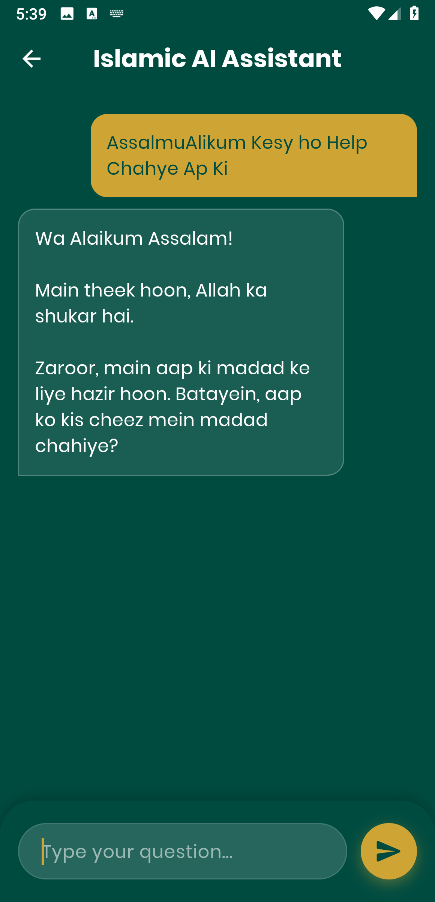
  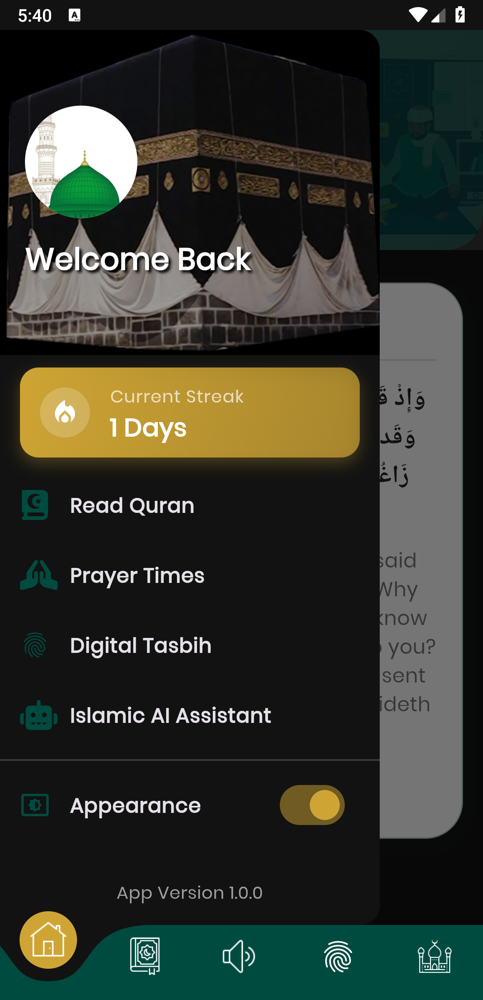
  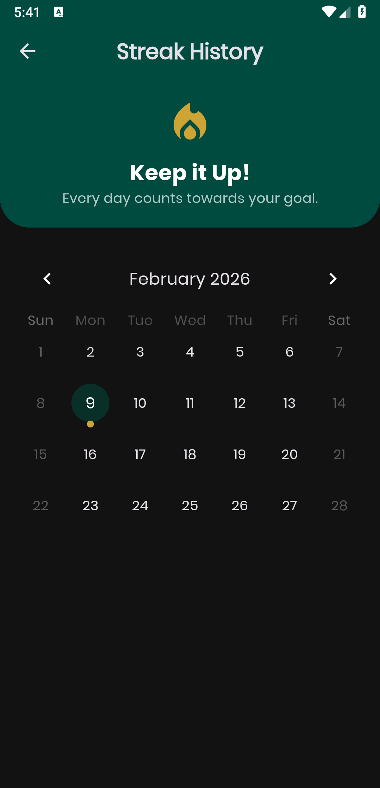
  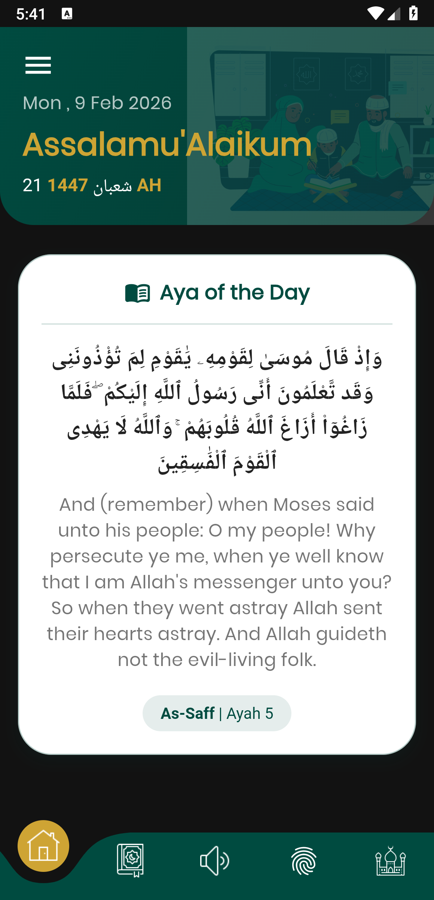
  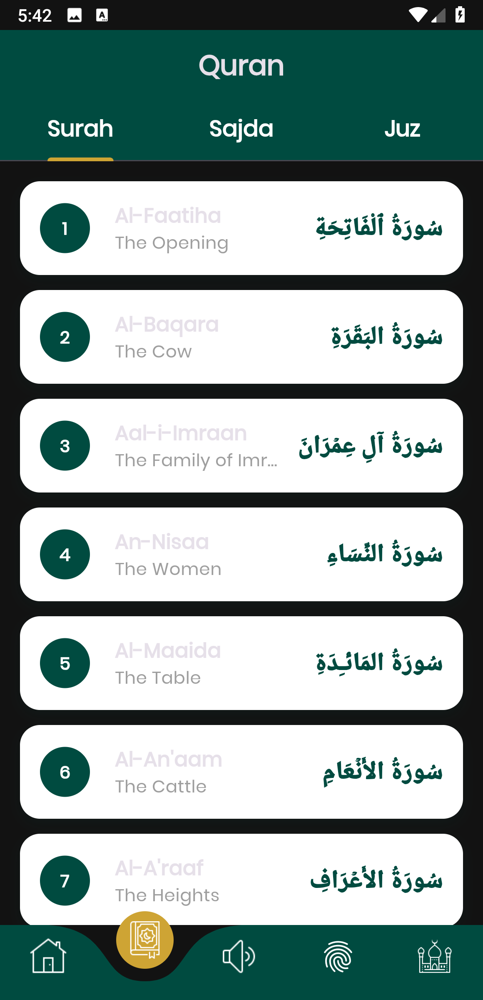
  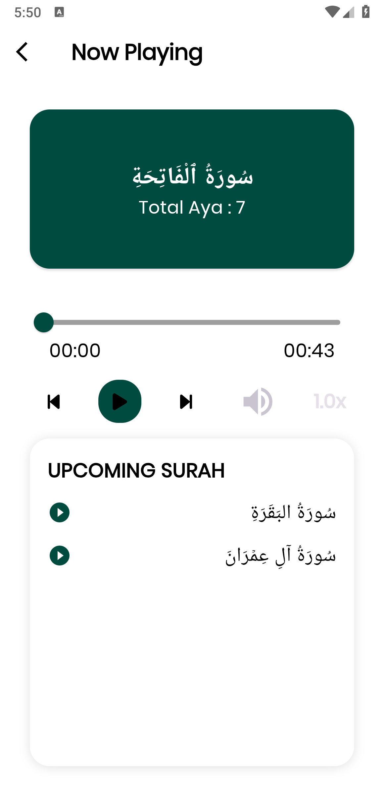
</p>

---
## Tech Stack
| Area                | Technology                          |
|---------------------|-------------------------------------|
| Framework           | Flutter (Dart)                      |
| State Management    | GetX                                |
| AI Integration      | Google Gemini API                   |
| API Integration     | REST APIs (Quran, Adhan)            |
| UI Components       | Convex Bottom Bar, Staggered Animations|
| Fonts               | Google Fonts – Poppins, Amiri       |
| Navigation          | Flutter Navigator 2.0               |

---
## Getting Started

### Prerequisites
- Flutter SDK → [flutter.dev](https://flutter.dev)
- Android Studio or VS Code
- A Gemini API Key

**Clone the repository:**
```bash
git clone https://github.com/NoorMustafa4556/Muslim-Soul-Quran-App-Flutter.git
```
```bash
cd Muslim-Soul-Quran-App-Flutter
```
```bash
flutter pub get
```
```bash
flutter run
```

# 👋🏻 Hi, I'm Noor Mustafa

A passionate and results-driven *Flutter Developer* from *Bahawalpur, Pakistan*, specializing in building elegant, scalable, and high-performance cross-platform mobile applications using *Flutter* and *Dart*.

With a strong understanding of *UI/UX principles*, *state management*, and *API integration*, I aim to deliver apps that are not only functional but also user-centric and visually compelling. My development approach emphasizes clean code, reusability, and performance.

---

## 🚀 What I Do

- 🧑🏻‍💻 *Flutter App Development* – I build cross-platform apps for Android, iOS, and the web using Flutter.
- 🔗 *API Integration* – I connect apps to powerful RESTful APIs and third-party services.
- 🎨 *UI/UX Design* – I craft responsive and animated interfaces that elevate the user experience.
- 🔐 *Authentication & Firebase* – I implement secure login systems and integrate Firebase services.
- ⚙ *State Management* – I use Provider, setState, and Riverpod (in-progress) for scalable app architecture.
- 🧠 *Clean Architecture* – I follow MVVM and MVC patterns for maintainable code.

---


## 🌟 Projects I'm Proud Of

- 🌤 **[Live Weather Check App](https://github.com/NoorMustafa4556/Live-Weather-Check-App)** – Real-time weather forecast using OpenWeatherMap API  
- 🤖 **[AI Chatbot (Gemini)](https://github.com/NoorMustafa4556/Ai-ChatBot)** – Conversational AI chatbot powered by Google’s Gemini  

- 🍔 **[Recipe App](https://github.com/NoorMustafa4556/Recipe-App)** – Discover recipes with images, categories, and step-by-step instructions  

- 📚 **[Palindrome Checker](https://github.com/NoorMustafa4556/Palindrome-Checker-App)** – A Theory of Automata-based project to identify palindromic strings  

> 🎯 Check out all my repositories on [github.com/NoorMustafa4556](https://github.com/NoorMustafa4556?tab=repositories)

---

## 🛠 Tech Stack & Tools

| Area                | Tools/Technologies |
|---------------------|--------------------|
| *Languages*       | Dart, JavaScript, Python (basic) |
| *Mobile Framework*| Flutter            |
| *Backend/Cloud*   | Firebase (Auth, Realtime DB, Storage), Django, Flask |
| *Frontend (Web)*  | React.js (basic), HTML, CSS, Bootstrap |
| *State Management*| Provider, setState, Riverpod (learning) |
| *API & Storage*   | REST APIs, HTTP, Shared Preferences, SQLite |
| *Design*          | Material, Cupertino, Lottie Animations, Gradient UI |
| *Version Control* | Git, GitHub        |
| *Tools*           | Android Studio, VS Code, Postman, Figma (basic) |

---

## 🧰 Tech Toolbox

<p align="left">
  
  
  
  
  
  
  
  
</p>

---

## 📈 Current Focus

- 💡 Enhancing Flutter animations and transitions
- 🤖 Implementing AI-based logic with Google Gemini API
- 📲 Building portfolio-level applications using full-stack Django & Flutter

---

## 📫 Let's Connect!

<p align="left">
  <a href="https://x.com/NoorMustafa4556" target="blank">
    
  </a>
  <a href="https://www.linkedin.com/in/noormustafa4556/" target="blank">
    
  </a>
  <a href="https://www.facebook.com/NoorMustafa4556" target="blank">
    
  </a>
  <a href="https://instagram.com/noormustafa4556" target="blank">
    
  </a>
  <a href="https://wa.me/923087655076" target="blank">
    
  </a>
  <a href="https://www.tiktok.com/@noormustafa4556" target="blank">
    
  </a>
</p>

- 📍 *Location:* Bahawalpur, Punjab, Pakistan

---

> “Learning never stops. Every app I build makes me a better developer — one widget at a time.”
